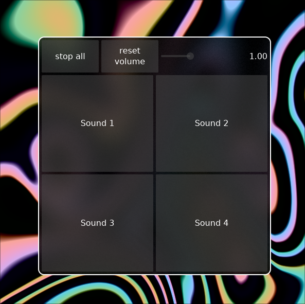

# Gridboard, a simple sounboard app



## Usage

### Main program

```
gridboard [path/to/config.jsonc] [-h | --help]
```

If no config path is provided, the app will get it's config from `$XDG_CONFIG_HOME/gridboard/config.jsonc` on Linux, `%APPDATA%\gridboard\config.jsonc` on Windows, or `~/Library/Application Support/gridboard/config.jsonc` on MacOS.

> [!NOTE]
> The app will not run without a valid config file, so you must create one before running. An example of a valid config file can be found below.

### Remote interaction

```
gridboardctl <command>
```

Commands:

- `play <path>`: Play a sound at <path>.
- `stop`: Stop the playback of all currently playing sounds.
- `volume`: Get the current volume (1.0 is full volume).
- `volume <volume>`: Set the current volume (1.0 is full volume).

## [Example config](example-config.jsonc)

```jsonc
{
  "channels": 2, // The amount of channels to open the audio stream with.
  "sample_rate": 48000, // The sample rate to open the audio stream with.
  "buffer_size": 4096, // The buffer size of the audio stream. The audio will start tearing if set too low.
  "gui": {
    // Can be set to null to make the engine run without a GUI.
    "window_width": 500, // The initial width of the window.
    "window_height": 500, // The initial height of the window.
    "buttons": [
      // The button definitions.
      [
        // The first row of buttons.
        {
          "name": "Sound 1", // The text to be displayed on the button.
          "sound": "/path/to/sound 1.mp3", // The path to the sound to be played with this button.
        },
        {
          "name": "Sound 2",
          "sound": "/path/to/sound 2.wav",
        },
      ],
      [
        // The second row of buttons.
        {
          "name": "Sound 3",
          "sound": "/path/to/sound 3.flac",
        },
        {
          "name": "Sound 4",
          "sound": "/path/to/sound 4.ogg",
        },
      ],
    ],
  },
}
```
